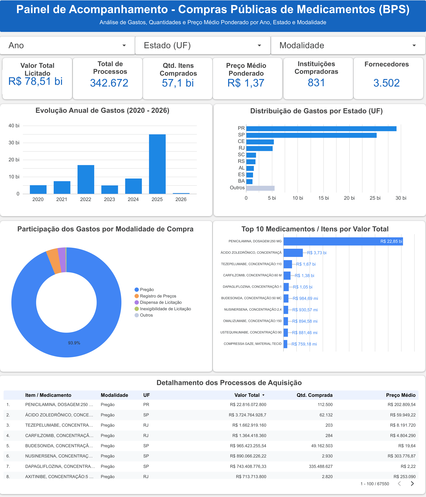

# Painel de Acompanhamento - Compras Públicas de Medicamentos (BPS)

## 1. Objetivo do Projeto
Consolidar, tratar e analisar a base de dados do Banco de Preços em Saúde (BPS) do Ministério da Saúde abrangendo o período de 2020 a 2026. O objetivo principal é disponibilizar um dashboard interativo no Google Looker Studio que possibilite o acompanhamento de gastos, volumes adquiridos e preço médio ponderado por ano, unidade federativa (UF) e modalidade de compra.

## 2. Contextualização do Problema
O gerenciamento e a transparência nas compras públicas de medicamentos no Brasil representam um grande desafio devido ao expressivo volume de transações descentralizadas e às variações de preços entre regiões e modalidades licitatórias. A falta de uma visão analítica unificada dificulta a identificação de discrepâncias de preços, a otimização de orçamentos públicos e o planejamento estratégico de aquisições de insumos hospitalares.

## 2.1. Perguntas de Negócio Direcionadoras
Para orientar a construção dos visuais e garantir o alinhamento com a gestão de compras públicas, o dashboard foi estruturado para responder às seguintes questões:

1. **Volume e Impacto Financeiro:** Qual é o montante total licitado e a quantidade de itens adquiridos pelo BPS entre 2020 e 2026?
2. **Evolução Temporal:** Como os gastos públicos com medicamentos se comportaram ao longo dos anos? Houve picos atípicos de investimento?
3. **Distribuição Geográfica:** Quais Unidades Federativas (UFs) concentram o maior volume orçamentário de compras públicas de medicamentos?
4. **Competitividade e Processos:** Qual é a representatividade das modalidades de compra (ex: Pregão vs. Dispensa) na alocação dos recursos?
5. **Concentração de Insumos:** Quais são os 10 medicamentos/itens de maior impacto financeiro no orçamento global?
6. **Alcance e Rede:** Quantas instituições compradoras e fornecedores distintos participaram das transações cadastradas?

## 3. Fonte dos Dados
Os dados brutos foram obtidos diretamente do portal aberto do **Banco de Preços em Saúde (BPS)**, mantido pelo Ministério da Saúde do Brasil, referentes aos anos de 2020 a 2026.

## 4. Procedimentos Utilizados para Baixar e Concatenar as Bases Anuais
1. Download dos arquivos `.csv` anuais disponibilizados pela plataforma BPS (2020 a 2026).
2. Desenvolvimento de um script automatizado em Python utilizando a biblioteca `pandas` e o módulo `glob`.
3. Leitura iterativa dos arquivos contornando divergências de codificação (`utf-8` e `latin1`).
4. Padronização dos nomes das colunas em letras minúsculas e remoção de espaços em branco.
5. Concatenação (*append*) de todas as tabelas em um único DataFrame consolidado.

## 5. Tratamentos e Transformações Realizados nos Dados
* **Normalização Monetária e Numérica:** Conversão de strings com pontuação brasileira (`.` como milhar e `,` como decimal) para o tipo `float` legível pelo BigQuery e Looker Studio.
* **Padronização de Datas:** Conversão das colunas `compra` e `insercao` para o formato standard `YYYY-MM-DD` e extração do ano da compra.
* **Remoção de Duplicatas:** Descarte de registros duplicados exatos para evitar contagem dupla de processos.
* **Filtragem de Inconsistências Críticas:** Eliminação de registros com quantidades ou preços zerados, nulos ou negativos.
* **Integridade de Valores:** Recálculo do `preco_total` via multiplicação do preço unitário pela quantidade.
* **Tratamento de Strings em Visuais:** Utilização da função `SUBSTR` no Looker Studio para encurtar descrições extensas de medicamentos no gráfico de barras, garantindo exibição limpa sem sobreposição de rótulos.

## 6. Descrição das Principais Colunas Utilizadas
* **`descricao_catmat` / `Item`:** Descrição padronizada do medicamento ou insumo de saúde.
* **`modalidade_compra`:** Modalidade licitatória utilizada (ex: Pregão, Dispensa de Licitação).
* **`uf`:** Sigla da Unidade Federativa onde a compra foi efetuada.
* **`compra` / `ano_compra`:** Data e ano de realização da transação pública.
* **`qtd_itens_comprados`:** Quantidade física de unidades adquiridas.
* **`preco_unitario`:** Valor unitário pago por item (R$).
* **`preco_total`:** Valor financeiro total homologado na compra (R$).
* **`cnpj_instituicao`:** Identificador único do órgão ou entidade compradora.
* **`cnpj_fornecedor`:** Identificador único da empresa fornecedora contratada.

## 7. Definição dos KPIs e das Métricas
O painel exibe **6 Scorecards executivos** no topo da página:

* **Valor Total Licitado:** Soma total do montante financeiro gasto em compras públicas (`preco_total`).
* **Total de Processos:** Contagem do número total de registros/processos de compra analisados (342.672).
* **Qtd. Itens Comprados:** Soma da quantidade de unidades adquiridas (`quantidade`).
* **Preço Médio Ponderado:** Média ponderada real gasta por unidade de medicamento (Razão entre o Valor Total Licitado e a Quantidade Total de Itens Comprados).
* **Instituições Compradoras:** Contagem distinta (`CTD`) de CNPJs de órgãos compradores públicos registrados.
* **Fornecedores:** Contagem distinta (`CTD`) de CNPJs de fornecedores e distribuidoras contratadas.

## 8. Estrutura Visual e Link do Dashboard
O dashboard foi desenvolvido em layout único (*single-page*) no padrão visual **Soft UI**, composto por **5 visualizações estratégicas**:

1. **Evolução Anual de Gastos (2020 - 2026):** Gráfico de barras verticais mapeando a distribuição temporal dos investimentos.
2. **Distribuição de Gastos por Estado (UF):** Gráfico de barras horizontais indicando a concentração regional do orçamento.
3. **Participação dos Gastos por Modalidade de Compra:** Gráfico de rosca exibindo a fatia percentual por tipo de licitação (ex: Pregão, Registro de Preços, Dispensa).
4. **Top 10 Medicamentos / Itens por Valor Total:** Gráfico de barras horizontais ordenado com os insumos de maior impacto financeiro.
5. **Detalhamento dos Processos de Aquisição:** Tabela analítica completa com paginação no rodapé para auditoria e consulta granular.

* **Link para o Dashboard Interativo:** [Acessar Painel BPS no Looker Studio](https://datastudio.google.com/u/0/reporting/29ccb9ca-44e3-42d3-8d8e-0d32cc5e996b/page/lMS8F/edit)

<p align="center">
  
</p>

## 9. Principais Análises e Descobertas
* **Volume Financeiro Aportado:** O montante total licitado no período analisado ultrapassou **R$ 78,51 bilhões**, englobando mais de **57,1 bilhões de itens** distribuídos em **342.672 processos**, envolvendo **831 instituições** e **3.502 fornecedores**.
* **Predominância Licitatória:** A modalidade **Pregão** representa a quase totalidade dos recursos movimentados (**93,9%**), demonstrando forte adesão aos mecanismos competitivos de contratação.
* **Concentração de Insumos Críticos:** O item *Penicilamina 250 mg* sozinho responde por mais de **R$ 22,85 bilhões** do orçamento total aprovado na base.
* **Distribuição Geográfica:** O estado do **Paraná (PR)** lidera o volume financeiro total licitado (~R$ 29 bi), seguido por **São Paulo (SP)** (~R$ 25 bi), enquanto outros estados como CE, RJ e SC apresentam volumes significativamente menores.
* **Evolução Temporal dos Gastos:** O pico histórico de gastos concentrou-se no ano de **2025** (~R$ 35 bi), apresentando uma forte elevação em comparação ao ciclo 2020–2024.
* **Preço Médio Ponderado Global:** O custo médio ponderado por unidade de insumo/medicamento adquirido situou-se em **R$ 1,37**.

## 10. Recomendações Baseadas nos Dados
1. **Centralização de Compras e Ganho de Escala:** Estimular compras compartilhadas entre estados vizinhos para aproximar os preços praticados por UFs com menor volume ao preço médio de SP/PR.
2. **Monitoramento de Picos Orçamentários:** Analisar os contratos firmados em 2025 para identificar se a alta nos gastos decorre de novos medicamentos de alto custo ou da ampliação do volume contratado.
3. **Padronização das Modalidades:** Manter a priorização da modalidade Pregão Eletrônico para ampliar a concorrência e mitigar aquisições diretas por dispensa não justificadas.

## 11. Limitações Identificadas na Base ou na Análise
* **Descontinuidade Temporal de 2026:** Os dados do ano corrente de 2026 registram apenas frações iniciais do exercício financeiro, impedindo a comparação anual completa sem anualização prévia.
* **Variação na Qualidade de Preenchimento:** Presença de registros históricos brutos com erros de digitação e ausência de padronização nas descrições de insumos antes do tratamento com Python.
* **Arquivos Extensos:** O volume de transações exige infraestrutura em nuvem (Google BigQuery) ou particionamento dos arquivos `.csv` para evitar estouro de memória no Looker Studio.

## 12. Instruções para Reprodução do Projeto
1. Clone este repositório em sua máquina local:
   ```bash
   git clone [https://github.com/DanielMusashi79/BPS_20_26_DanielRoberto.git](https://github.com/DanielMusashi79/BPS_20_26_DanielRoberto.git)